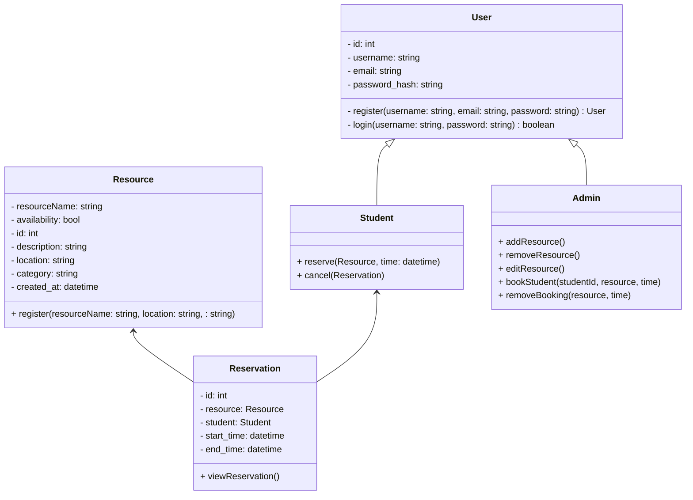

# Campus Resource

A Website to Manage, Book, and Schedule Resources for Students

**PERMANENT URL:**

[Campus Resource Website](https://campus-resource-318935754370.us-west1.run.app)

## Data Model

